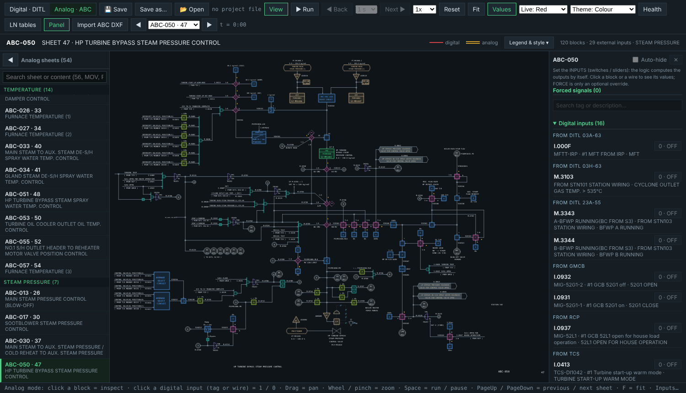

# Logic Sim — User Manual (v1.15.2)

Logic Sim is an offline simulator and viewer of the plant DCS logic drawings: the digital interlock pages (DITL) and the 54 analog control sheets (ABC). It runs from one file, with no network, no OPC and no connection to the plant. It is for study, training and checking logic. It is **not** connected to the real DCS and never writes to it.

Contents: 1 Installation · 2 Familiarization · 3 How to use · 4 Troubleshooting · 5 What is and is not simulated

---

## 1. Installation

Download from **GitHub → Releases** (take the latest `vX.Y.Z`). All three files have the same version in the name:

| File | For | Install |
|---|---|---|
| `logic-sim-vX.Y.Z.html` | Any computer with Chrome / Edge | None. Double-click, or drag into the browser. Works offline. |
| `logic-sim-vX.Y.Z-portable.exe` | Windows | None. Portable: no installer, no administrator rights. Double-click to run. |
| `logic-sim-vX.Y.Z.apk` | Android | Copy to the phone/tablet, open it, allow "install unknown apps" for your file manager when asked. |

Notes
- **Windows SmartScreen** may say "Windows protected your PC" because the exe is not code-signed. Click *More info → Run anyway*. The app has no network access (it blocks all of it).
- **Android** may warn about an unknown app for the same reason. The apk is signed with a sideload key, not a Play Store key.
- Updating = download the new version and use it. Your settings are not inside the program: save a **project file** (section 3.6) and open it in the new version.
- Only one version is needed. Old versions can be deleted.

## 2. Familiarization

### 2.1 The two pages
The top-left switch chooses the page:
- **Digital · DITL** – the digital interlock logic pages (gates, flip-flops, timers). Read-only drawing behaviour; this page is never modified.
- **Analog · ABC** – the analog control sheets: controllers (PID), selectors (auto/manual and T switches), transmitters, valves/actuators, compensation and linear tables, with the digital permissives feeding them.

The app always **opens in VIEW mode** (section 2.5). Nothing is simulated until you press Run.

### 2.2 The analog screen

Top bar, left to right:

| Control | Meaning |
|---|---|
| 💾 Save / Save as… / 📂 Open | Save or open a **project file** (Ctrl+S). Keeps inputs, forces, switches, settings and your linear-table edits. |
| View | View mode (default): see 2.5. |
| ▶ Run / ❚❚ Pause | Start / pause the simulation (Space). Run from VIEW starts the simulation. |
| ◀ Back · 1 s…60 s · Next ▶ | While paused: step the time forward or roll it back by the selected amount. |
| 1x…300x | Simulation speed. Each PID panel suggests a realistic speed for its loop. |
| Reset | Put everything back to the drawing's start state (inputs, forces, timers). Your linear-table edits are **not** cleared; they have their own reset. |
| Fit | Fit the sheet to the screen (key F). |
| Values | Show/hide the live values on the drawing. |
| Live / Theme | Colour of live signals; *Colour* theme or the muted *Engineering* theme. |
| Health | Reader health report of the sheet. |
| LN tables | The F(X) linear tables and their graph. |
| Panel | Show/hide the right panel. |
| Import ABC DXF | Load updated drawings; kept in this browser (see 3.9). |
| Imports | List of imported drawings, drawing-change report, Back to built-in. |
| ◀ sheet ▶ | Previous / next sheet. PageUp / PageDown also work. |

Left list: the 54 sheets grouped by function, with a search box (sheet name, or any text in the sheet).

Right panel: lists the sheet's **inputs** (digital switches, analog sliders / number boxes), forced signals, and – when you select something – the details of that block or wire.

### 2.3 Colour language
- Digital wire: thin line, live colour when **1**, grey when 0. Analog wire: thin solid line, always coloured (it carries a value, even 0); only in VIEW is it grey (the double-line tube is still available in *Legend & style*).
- Not-selected leg of a T (A/M) switch is grey; the selected leg is lit. Each leg is judged separately.
- A forced signal is dashed and carries a badge.
- Run and Pause use the same colours. View is all grey (see 2.5).
- Values are green by default (changeable in *Legend & style*).
- Valve/actuator: green = closed, red = open, blue = in between, white blinking = moving.

### 2.5 The three modes
| Mode | What it does |
|---|---|
| **VIEW** (default when the app opens) | Every wire is grey so the lines are easy to read. Nothing is simulated and no input or force can be changed. Click a block or a wire to **trace** it automatically (see 3.4); click an empty place to clear the trace. |
| **RUN** | Press Run (or Space). The wires that should be live light up. Starting from VIEW changes nothing by itself: no value is forced. Inputs and forces exist only after you set them; Reset removes them all. |
| **PAUSE** | Same colours as RUN, but frozen. Choose a step (1, 5, 10, 30 or 60 s) and press **Next ▶** to run the logic forward by that time, or **◀ Back** to roll it back by that time. |
Press **View** to return to VIEW at any time (it also stops the run; your values are kept and shown again when you go back to RUN).

### 2.4 Addresses and descriptions (unit 1)
Tags such as `I.0413`, `M.3103`, `TR0708`, `S1 M.0160` are looked up in the unit-1 IO list and memory lists that are built into the app. When you select a tag (digital) the tag is highlighted **yellow**; for analog it is **sky blue**; and a small card shows *tag name [address · station]*, the description and the type. Hover the mouse on ANY address text of the drawing (SI, B, I, O, M, TR...) and the same card appears; select a block that carries an address (for example SIG.AB) and its card is shown. The input list in the right panel also shows the description under each tag, and the search box finds by description.

## 3. How to use

### 3.1 Open a sheet and run it
1. Choose **Analog · ABC**, pick a sheet from the left list (e.g. ABC-050).
2. Set the inputs in the right panel: click a digital input (or the tag on the drawing) to toggle 1/0; type a value or drag the slider for analog inputs.
3. Press **Run** (or Space). Watch the outputs. Press **Pause** to stop.
4. Origin signals (inputs) are set by you; driven signals are computed by the logic. **FORCE** (in the panel, for any selected wire) is an optional override of a computed value – use it for testing only; *Release* removes it.

### 3.2 Step through the logic (paused)
Press **Run**, then **Pause**. Choose 1 / 5 / 10 / 30 / 60 s and press **Next ▶** or **◀ Back**. The colours are the same as in RUN, so you see exactly what turned on or off. Back restores the whole simulation state of that moment (values, timers, valves). It keeps about the last 10 minutes of simulated time; a Back that is farther than the history goes to the oldest point. Inputs you changed after that moment are not replayed.

### 3.3 Select and understand a block
Click a block or a wire. The right panel shows its inputs and outputs with live values, its parameters (timer seconds, PID tuning, ranges, …) and a **Why?** line that explains the present output in words (e.g. "AND = 0: M.3103=0 is 0 (one 0 is enough)"). For some kinds the explanation is general ("Inputs now … → output …") because a detailed text is not written yet.

### 3.4 Trace (VIEW mode)
1. In VIEW, click a wire or a block. The trace appears by itself: a **glow** is drawn around the wires, white = what you selected, **blue = driven by** (upstream), **magenta = feeds** (downstream); the rest is dimmed.
2. The panel lists each wire with its name, description and value. Click a row to move the selection there.
3. For T/A-M switches only the leg in use is followed. *Selected T leg only / Both T legs* follows both.
4. **Leaving the sheet.** Under the title *Trace* the panel lists **every exit** of the selected signal ("This signal leaves the sheet (n): ▶ ABC-004A (circle 12) → receiving wire · description · feeds k"), not cut by the 60-row limit of the lists. Each wire in the lists that continues in another sheet also has a pink row **▶ continues in sheet ABC-xxx (circle n) → wire · description · feeds k blocks**. One click opens that sheet with the receiving wire(s) selected and the trace goes on there. A circle that says "( TO ABC-001D ) ( TO ABC-020 )" gives one row per sheet. A grey row says **→ to DITL pp-nn** (the signal leaves to the DITL page: not simulated) or **◀ from DITL pp-nn**. A row **◀ sheet ABC-xxx** means the input comes from another sheet: click it to jump to the sending wire.
5. **Path (breadcrumbs).** After a jump the panel shows **Path: ABC-003B › ABC-003A › ABC-002 › ABC-004A**. Click any sheet name to return there in ONE click (the path after it is dropped), **⟲ Back to start** returns to the first sheet and its wire, **Clear path** forgets it. A sheet that is already in the path is not added again: when the signals go round in a circle (A → B → A) the path is cut back, it never grows without end. ↩ Back still goes one step at a time.
6. **Map: where does this signal go (all sheets).** One button shows the whole cross-sheet downstream of the selection in ONE list: indented by hop, one line per sheet (a sheet reached again is shown once as ↺), each line = sheet · receiving wire · description · what it feeds (block kinds). Click a line to go there; the path is kept.
7. Click an empty place of the drawing: the trace goes away and you are back in plain VIEW.

### 3.4b Trend (live graph of a block or a wire)
Select ANY block or wire (in VIEW, RUN or Pause): the panel shows a **Trend**: a small live chart (normal view) with the name and live value of each trace. PID / PIDV: **SV, PV, MV** (SV and PV are the two inputs of the DEV block that feeds the PID). Every other block (FX linearizer, MAN, SUMA / SUMP integrator, ramps / rate limiters, LAG, math, switches, selectors, alarms, valves ...): its **inputs and outputs**. A wire: that wire. **Window**: 30 s, 1 min, 5 min, 10 min, All. **Zoom ⤢** opens a big window: wheel = zoom in time, drag = move in time, **Follow live**, click a trace name to hide / show it, *each trace on its own scale* (set automatically when the traces have very different ranges, for example PV in kg/cm2 and MV in %). **Clear** forgets the history of the sheet; Esc closes the big window. The history (one sample every 0.25 simulated seconds, up to 10 minutes, per sheet) starts when you select the block; it needs the simulation to run (▶ Run or Next ▶).

### 3.4c DITL signals (button)
The DITL page is not simulated with the ABC sheets and is not touched. The signals that the ABC sheets say come **FROM DITL pp-nn** are inputs of the ABC set: the button **DITL signals** lists them (sheet, DITL reference, wire name and description, live value) with a **one-click control** (switch 1 / 0, or a number for an analog input). It works in RUN and Pause, all linked sheets run together, and everything that the ABC logic computes stays under the control of the logic (it is not in the list). The signals that go **TO DITL pp-nn** are listed with their live value (read-only). Texts that cannot be tied to a wire are counted and named at the top of the list.

### 3.5 PID controllers
Select a PID block. The panel shows PV, SV, output, A/M mode and tuning (Kp, Ti, Td), direct/reverse action, and the range read from the drawing. Default tuning is chosen by the loop type from the tag (flow, pressure, temperature, level, analysis, speed) and a **Use this speed** button sets the simulation speed that suits the loop. These are typical values, **not** the plant's real tuning: replace them when you have the real data.

### 3.6 Project file (save and restore your work)
- Press **💾 Save** (Ctrl+S). The first time it asks where; after that it overwrites the same file. *Save as…* makes a new file; *📂 Open* loads one.
- The file stores inputs, forces, switches, sliders, settings and linear-table edits for all sheets, and the current sheet. It also remembers which version saved it.
- The app also keeps a copy in the browser's storage, but a project file is the only copy you control: save one before changing computer, browser or version.
- Windows exe: Save/Open use normal file dialogs. Android: Save shows the share sheet (save to Files/Drive/…), Open picks a file.

### 3.7 LN tables (F(X) linearization)
The 89 DCS linear tables of LINEAR.xls are built in, plus S1-LN38 and S1-LN39 of the drum level (from the Drum Level Calculation file). **LN tables** shows the graph. **Edit table** lets you change the LX/LY points (in percent of the ranges; X and Y are computed). A warning shows if LX goes backward. Edits have their own **Reset this table** and **Reset ALL linear edits**; Reset on the sheet does not clear them. Each FX block finds its table by station and LN number; if only another station has that number, a warning is shown in the FX panel instead of silently using it.

### 3.8 View mode
See 2.5 and 3.4. In VIEW nothing can be changed by accident: you can select, search, trace and read the descriptions.

### 3.9 Updating drawings (Import ABC DXF) — v1.15.2
**Import ABC DXF** loads updated analog drawings (the sheet name is the file name, e.g. `ABC-050.dxf` replaces ABC-050). The imported file is **kept in this browser** and used again every time you open the app. The saved values (forces, inputs) of that sheet are cleared at import, because the numbers of the wires can change. After the import the **Imports** panel opens with the **drawing-change report**: counts of blocks / nets / lines / circles / texts (built-in vs imported), the block kinds that changed, and the blocks and texts that exist in only one of the two. "IDENTICAL" means nothing changed. **Back to built-in** removes the import and returns to the built-in drawing. Check **Health** afterwards and keep a saved project file before importing.

### 3.10 Assumed values and data files
Some numbers are **not written on the drawings**. The button **Assumed values** (Analog bar, next to *LN tables*) lists all of them, and the panel of the block says it too:
- **TP** (flow temperature compensation, 8 blocks): the operating temperature comes from your Compensation file (302 / 35 / 91 / 287 °C). Real data. DP' = DP / Kt.
- **ALM** (104 alarms): the four limits HH / H / L / LL are **ASSUMED** for a 150 MW CFB boiler with reheat. They are NOT the DCS values. Type your own value in the block panel to replace one (it is saved with the project).
- **Ramp boxes** (8 boxes without a rate on the drawing) and **PO / PIDV pulses** (cycle 2 s, full stroke 60 s, shortest pulse 0.2 s): **ASSUMED**, editable in the panel.
- **F(X) LN38 / LN39 of ABC-010** (drum level compensation): taken from your Drum Level Calculation file because LINEAR.xls has them only for station 2.
Every number, with the reason for it, is in `docs/ASSUMED-VALUES.md`; the files you sent and where each one is used are in `docs/DATA-FILES.md`.

### 3.11 Keyboard
Space run/pause · PageUp/PageDown or ←/→ sheet · F fit · Ctrl+S save · wheel/pinch zoom · drag pan.

## 4. Troubleshooting

| Problem | What to do |
|---|---|
| The page is blank or the sheet list is empty | Wait a few seconds on first open (the data unpacks). Use a current Chrome/Edge. Do not open the html from inside a zip: extract first. |
| Windows says "protected your PC" | Normal for an unsigned exe. *More info → Run anyway*. |
| Android will not install | Allow "install unknown apps" for the app you opened the apk from. If an older Logic Sim is installed from a different key, uninstall it first. |
| Nothing moves / all wires are grey | The app opens in VIEW: press Run. Valves, timers and ramps move only while running or while you press Next ▶. |
| I changed an input but the output did not change | Output may be waiting on a timer, or is forced (dashed wire / *Forced signals* count). Release the force. |
| A typed value jumps back | Press Enter or click ✓ after typing; the box keeps your number until then. |
| My settings are gone | The browser storage was cleared or blocked (private window). Open the saved project file. The status text in *Legend & style → Saving* tells which storage works. |
| Reset removed my forces but not my linear edit | By design: linear edits have their own reset. |
| Values I saved in an older version are gone | When a new version changes how the drawings are read, the saved values of the affected sheets are dropped (the settings stay). Re-enter them and save a new project file. |
| A warning appears in an FX block about a station | The LN table number exists only in another station; the app used it and warns you. Check the drawing. |
| Description missing for an address | The IO/memory lists cover unit 1 only. Some labels are not in the lists. |
| Something else | Note the sheet name, what you clicked, and a screenshot, and report it. |

## 5. What is and is not simulated
Checked against the drawings and your files (v1.15.0): flip-flops (reset wins when S = R = 1) and timers follow the symbol list of ABC-000; 150 of 153 timers equal the TR table of your memory lists (type and time); 157 of 157 AI ranges equal your IO list; in the simulation every digital output of the 51 sheets can be driven to both 0 and 1 (2191 of 2192; 18 need a sequence of input changes, e.g. latches and pulses); every link between sheets carries its value; no wire is a dead end except the real exits (TO DITL / TCS, annunciator, memory bit); on the screen a digital wire is lit only when its value is 1. The ABC → DITL crossings are not simulated (the DITL page is never touched). This shows the logic is read completely, not that it matches the plant: sheet-by-sheet comparison with the PDFs is still open.
Simulated: gates, flip-flops, timers (TON/TOF/pulse), T/A-M selectors, comparators, SEL (average of healthy transmitters), CTK, PID with typical tuning, valves/actuators with travel time, ramps, linear and compensation tables, constants, alarms (limits assumed), pulse output.
Not (yet): the real plant response (there is no plant model: you set the PV yourself or through a simple model), real PID tuning and alarm limits of the plant, other units than unit 1 for descriptions, communication with the real DCS. A few drawing symbols are still unrecognised (listed in docs/BACKLOG.md). Treat results as a study aid and verify against the real system before acting on them.
